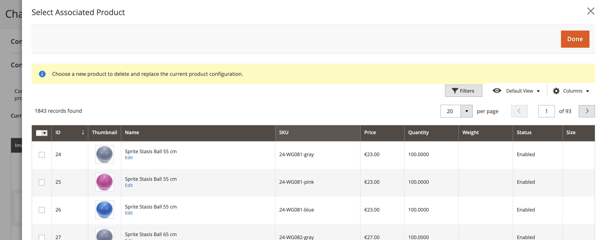
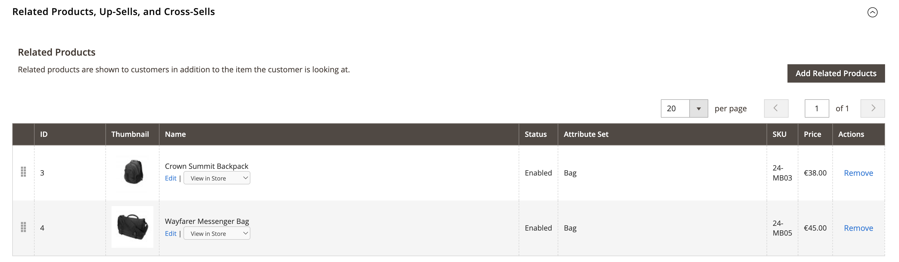
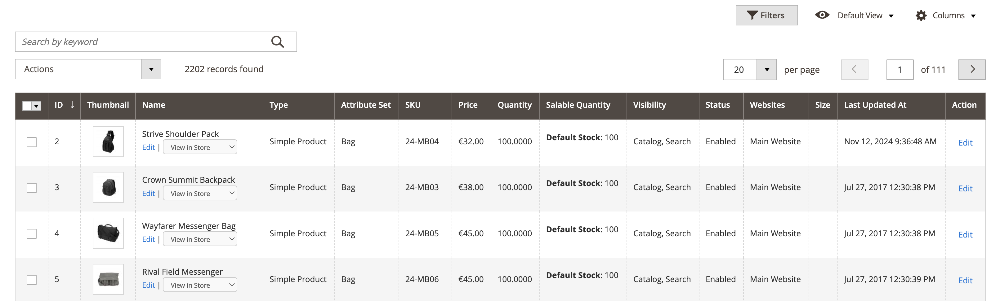

# ProductLinksNavigator


**ProductLinksNavigator** is a Magento 2 extension for enhanced admin product navigation. It is especially useful for
merchants who want to simplify the process of navigating complex and custom product relationships.

## Features

- **Integrated Product Links:** Adds "View in Store" (frontend) and "Edit" (admin) links to the following grids and modals:

    - Bundle items grid and selection modal:

      <table align="center">
        <tr>
          <td align="center">
            <br>
            <strong>Bundle Items Grid</strong>
          </td>
          <td align="center">
            <br>
            <strong>Bundle Items Selection Modal</strong>
          </td>
        </tr>
      </table>

    - Configurable items grid and selection modal:

      <table align="center">
        <tr>
          <td align="center">
            <br>
            <strong>Configurable Items Grid</strong>
          </td>
          <td align="center">
            <br>
            <strong>Configurable Items Selection Modal</strong>
          </td>
        </tr>
      </table>

    - Related, Cross-sell, and Up-sell products and selection modal:

      <table align="center">
        <tr>
          <td align="center">
            <br>
            <strong>Related Products Grid</strong>
          </td>
          <td align="center">
            <br>
            <strong>Related Products Modal</strong>
          </td>
        </tr>
      </table>

    - Product grid:

      <table align="center">
        <tr>
          <td align="center">
            <br>
            <strong>Product Grid</strong>
          </td>
        </tr>
      </table>

- **Parent Products Tab:** Lists all the parent products of the product you are currently editing:

  <table align="center">
    <tr>
      <td align="center">
        <br>
        <strong>Parent Products Tab</strong>
      </td>
    </tr>
  </table>

## Installation

Install via Composer:

```bash
composer require elnino/product-links-navigator
bin/magento module:enable ElNino_ProductLinksNavigator
bin/magento setup:upgrade
bin/magento cache:clean
```

## Customisation

### Adding links to custom product relation grid/modal

If you have a custom product relation set up, you can allow adding the links for this relation's grid and modal. Extend
the data scopes array in your custom module `di.xml`:

```xml

<type name="ElNino\ProductLinksNavigator\Ui\DataProvider\Product\Form\Modifier\RelatedProductLinks">
    <arguments>
        <argument name="dataScopeArray" xsi:type="array">
            <item name="0" xsi:type="string">related</item>
            <item name="1" xsi:type="string">crosssell</item>
            <item name="2" xsi:type="string">upsell</item>
            <item name="3" xsi:type="string">your_custom_scope</item> <!-- Add your custom scope here -->
        </argument>
    </arguments>
</type>
```

### Accommodate a custom parent product type

The module currently lists all the existing parents of Configurable, Grouped and Bundle types. If you have a custom
product type that serves as a parent, you can modify the implementation of parent product retrieval in
`\ElNino\ProductLinksNavigator\Helper\ParentProductHelper::getParentProducts`.

## Compatibility

**ProductLinksNavigator** is compatible with:

- Magento 2.4.x and later
Hyvä Theme

## License

ProductLinksNavigator is built by El Niño, a digital development studio in Enschede and The Hague, the Netherlands, that
builds custom web and mobile apps, webshops, and more, backed by 15+ years of experience.

This module is open-source and available under the MIT License.
