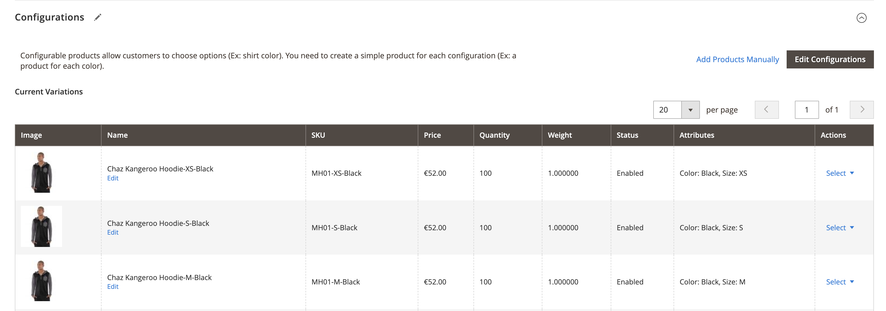

# ProductLinksNavigator

**ProductLinksNavigator** is a Magento 2 extension for enhanced admin product navigation. It is especially useful for
merchants who want to simplify the process of navigating complex and custom product relationships.

## Features

- **Integrated Product Links:** Adds "View in Store" (frontend) and "Edit" (admin) links to the following grids and
  modals:
    - Bundle items grid and selection modal

      |  |  |
                |:--------------------------------------------------------------:|:--------------------------------------------------------------------------------:|
      |                     **Bundle Items Grid**                      |                         **Bundle Items Selection Modal**                         |

    - Configurable items and selection modal

      |  |  |
                    |:-------------------------------------------------------------------------------:|:--------------------------------------------------------------------------------------------:|
      |                            **Configurable Items Grid**                            |                            **Configurable Items Selection Modal**                            |
    - Related, Cross-sell, and Up-sell products and selection modal

      |  |  |
                |:-------------------------------------------------------------:|:---------------------------------------------------------------------:|
      | **Related Products Grid**                                     | **Related Products Modal**                                           |
    - Product grid

      |  |
          |:----------------------------------------------------:|
      |                **Product Grid**                     |
- **Parent Products Tab:** Lists all the parent products of the product you are currently editing.

  |  |
  |:------------------------------------------------------------------:|
  |                **Parent Products Tab**                            |

## Installation

Install via Composer:

```bash
composer require elnino/product-links-navigator
bin/magento module:enable ElNino_ProductLinksNavigator
bin/magento setup:upgrade
bin/magento cache:clean
```

## Customisation

### Adding links to custom product relation grid/modal

If you have a custom product relation set up, you can allow adding the links for this relation's grid and modal. Extend
the data scopes array in your custom module `di.xml`:

```xml

<type name="ElNino\ProductLinksNavigator\Ui\DataProvider\Product\Form\Modifier\RelatedProductLinks">
    <arguments>
        <argument name="dataScopeArray" xsi:type="array">
            <item name="0" xsi:type="string">related</item>
            <item name="1" xsi:type="string">crosssell</item>
            <item name="2" xsi:type="string">upsell</item>
            <item name="3" xsi:type="string">your_custom_scope</item> <!-- Add your custom scope here -->
        </argument>
    </arguments>
</type>
```

### Accommodate a custom parent product type

The module currently lists all the existing parents of Configurable, Grouped and Bundle types. If you have a custom
product type that serves as a parent, you can modify the implementation of parent product retrieval in
`\ElNino\ProductLinksNavigator\Helper\ParentProductHelper::getParentProducts`.

## License

ProductLinksNavigator is built by El Niño, a digital development studio in Enschede and The Hague, the Netherlands, that
builds custom web and mobile apps, webshops, and more, backed by 15+ years of experience.

This module is open-source and available under the MIT License.
